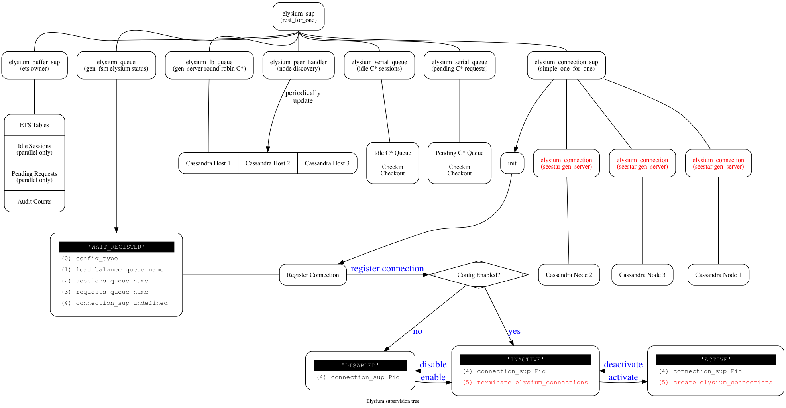
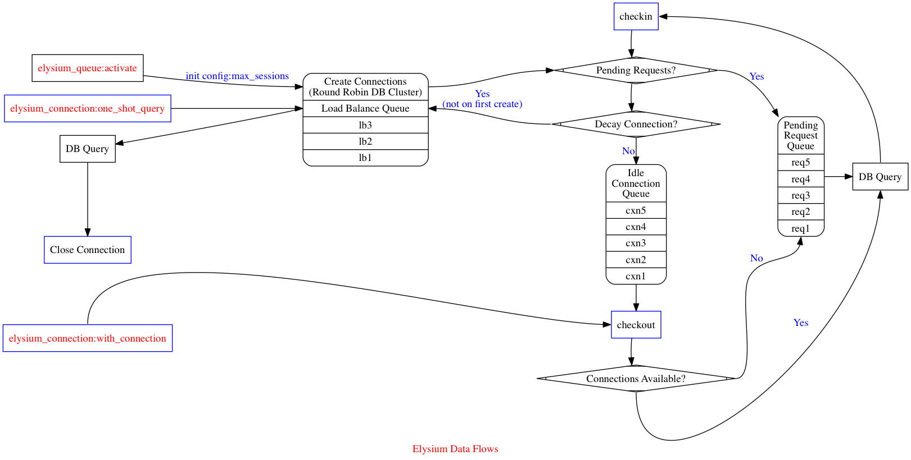

elysium
=======

### Elysium provides dynamic access to a Cassandra cluster

  - Uses round-robin connection semantics
  - Manages live connections via checkin/checkout
  - Addresses overload using a pending request queue
  - Periodically checks for new Cassandra nodes

-------
### Resilience is provided via rest_for_one supervision

  - ETS data management: elysium_buffer_sup
  - Application status/control: elysium_queue
  - Load balancing: elysium_lb_queue
  - Cassandra node discovery: elysium_peer_handler
  - Connection queues: serial queue of connections and requests
  - Connection management: elysium_connection_sup

-------
### Supervision tree

-------
### Queues are more persistent than connections

  - Loss of all connections does not affect queues
     - unless elysium_sup itself is taken out
     - ets tables, status/control are last to die
     - ensures monitoring works when things are down
  - activate/deactivate adds/destroys connections
     - currently too abrupt
     - in future will nicely drain in flight queries
  - load balancing survives when requests/connection queues down
     - cluster node discovery runs even if connections gone
     - activate creates new connections using round-robin

-------
### Basic operation is a checkin/checkout

  - Load balancing via a ring buffer
     - checkin/checkout Cassandra {Host, Port}
     - connections are round-robin
     - slow to respond nodes are skipped
     - ring buffer updated by elysium_peer_handler
  - Connections are in a checkin/checkout queue
     - implemented as a behaviour
     - currently relies on elysium_serial_queue
     - elysium_parallel_queue trips on concurrency issues
  - Requests checkout a connection and then check it back in
     - if none available, request is put in pending queue
     - connection is long-lived seestar Cassandra socket gen_server
  - Also supports a one-shot request
     - spawns a new seestar connection
     - discards the connection after the request completes

-------
### Stochastic connection migration

  - Connections decay periodically
     - randomly in N chances per 1 Billion requests
     - decayed connections are immediately replaced
     - the new connection is placed at the end of the queue
     - unless it is used immediately on a pending request
  - Reconnect avoids congestion
     - round-robin skips slow to respond nodes
     - redistributes all connections over time
     - restarts seestar sessions to avoid memory/staleness issues

-------
### Data flow logic

-------
### Three methods of configuration

  - {config_mod, Module}
     - defines a functional interface for all config values
     - allows adaptive functionally changing parameters
  - {vbisect, Binary}
     - uses a binary dictionary for all config values
     - shared, lock-free, read-only configuration
     - any changes have to be distributed to running processes
  - {config_app_config, elysium}
     - refers to a top-level config block in the app.config file
     - has to be the name of a loaded application
     - simplest is to use elysium as an included_application
  - Performance is not equal
     - config_mod is 50% slower
     - vbisect and app.config seem to have similar performance
     - not measured with 16-core or more servers

